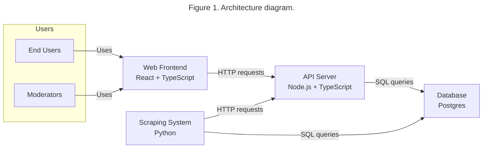
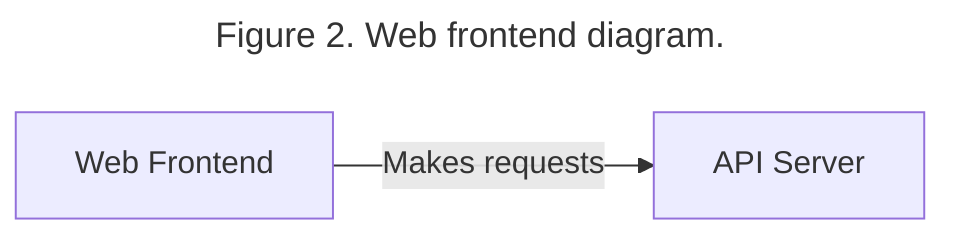
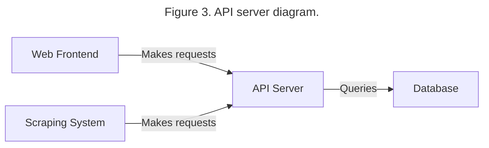
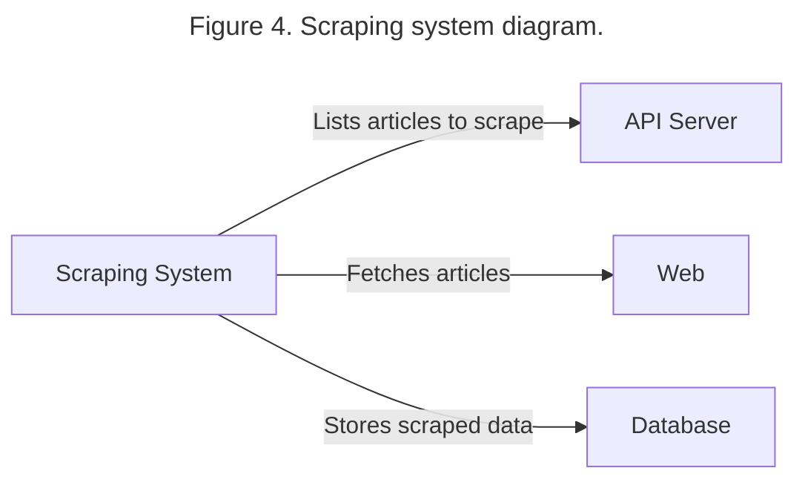
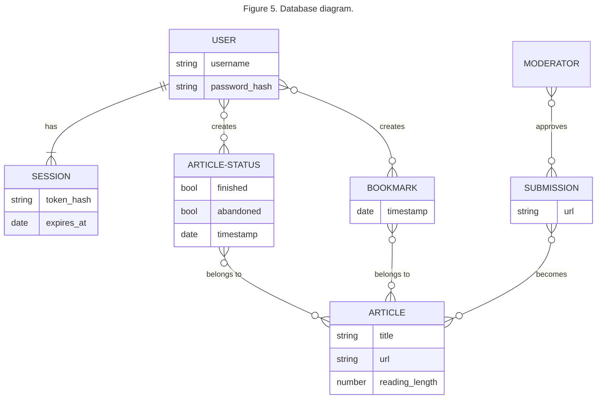
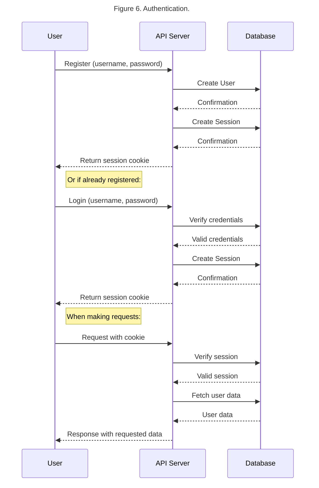
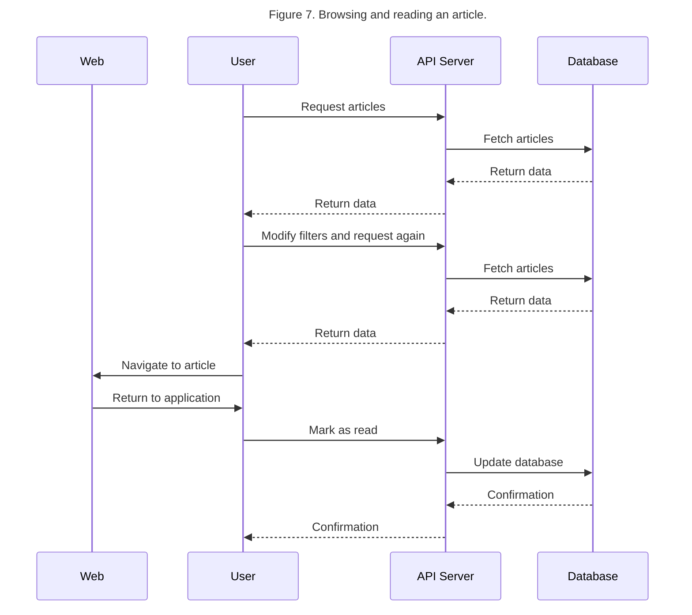
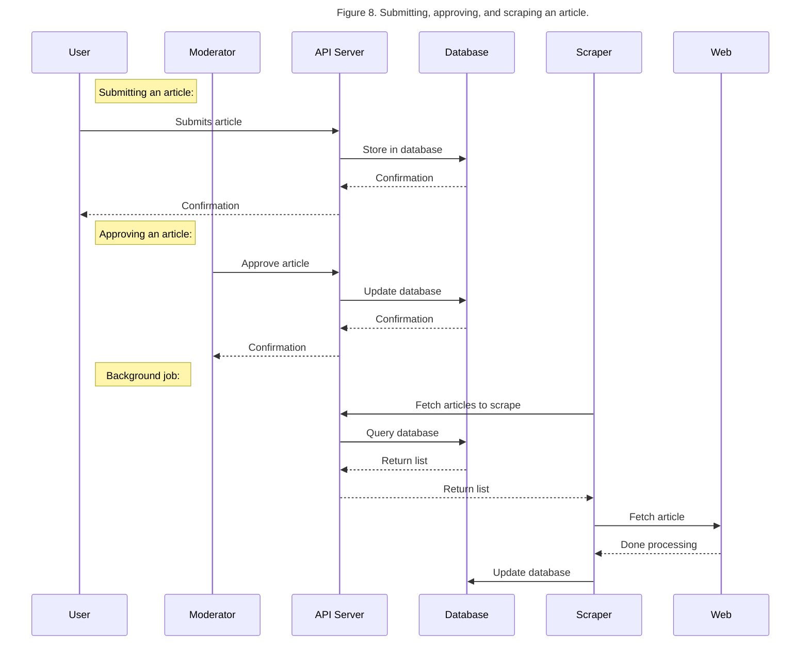

# Software Design Specification

## SDS Revision History
- 02/19/2025: Initial draft (SE, AM, HP, AW, JW, KW)
- 02/26/2025: Final version (HP, JW)

## Overview
ByteSized Reads is a web-based application and is organized in a client-server architecture.
A web frontend allows end users to interact with the backend to use the server.
The backend includes a database, API server, and scraping system to provide the system’s functionality.
Additional tools are exposed via the web frontend for data curation and other moderation tasks.

## Architecture

We chose the client-server model as it’s standard for web applications.
The system is broken up into a few main components to facilitate parallel development and compartmentalization:

- Web frontend: Web application for end users and moderators. Interacts with the API server to fetch and modify data. Implemented using React and Typescript.
- Web server: Serves the web frontend.
- API server: Provides a web API for the frontend. Implements system functionality by querying and modifying the database to handle user requests. Implementing using Node.js and Typescript.
- Database: Main store for application data, including users, indexed content, and other supporting data. We are using Postgres.
- Scraping system: Scrapes articles and interacts with the API server to update the database. We are using Python.

### Alternative Designs
We considered other application platforms besides the web, but ultimately settled on using the web platform.
Developing for web has the advantage of being easily deployed everywhere.
Developing a native desktop app usually requires vastly different code per-platform, which we don't have the resources to do.
Developing mobile applications is a similar story.
For desktop and mobile, there exist tools to write code once and deploy to all platforms, but overall we were more familiar with the web platform
and confident in its ability to satisfy our project requirements. Developing for web also reduces the burden of updating the system,
as changes only need to happen on the server side, and users don't need to do anything to receive system updates.

Since we settled on developing for the web platform, the client-server model is somewhat required.
Instead of having a live API server, we could have statically generated the site.
However, this makes it difficult or impossible to display different interfaces for different users, which is a requirement for us (in order to display personalized recommendations, bookmarks, etc).
We also considered combining the scraping system with the API srever.
However, we decided that our team's experience with Python and the strength of the Python ecosystem for web scraping and other data-related tasks
was worth the added complexity.
Having the scraping system separate also facilitates parallel development,
and allows it to be run on-demand or as a scheduled job instead of being part of a monolithic API.

## Modules

### Web Frontend

The web frontend is developed using React and TypeScript.
These technologies were chosen bceause they are well-established for web development, and build on the Javascript ecosystem which is almost universal on the web.
We considered other web frameworks, but chose React for its popularity.
We also considered not using a web framework such as React for simplicity,
but decided that the benefits of using a structured framework outweighed the complexity.

The frontend does not expose functionality to the other parts of the system,
but instead provides the entry point for users to interact with the system.
The specifics of the user interface have not been designed at the time of writing,
but all application use cases will involve the user interacting with the frontend using links, buttons, forms, etc. to submit requests and display data from the API server.

### API Server

The API server is implemented using Node.js and TypeScript,
and is intended to be consumed by the web frontend and scraping system.
It handles requests and performs business logic by querying the database.
It also handles user authentication.
We considered using Python for the API server, potentially using Django.
However, we chose to use TypeScript instead due to familiarity, and to allow us to take advantage of the Javascript web ecosystem
and share code and types between the frontend and backend.

The API server exposes a REST API over HTTP.
Specifics of each API endpoint are being determined as the features are implemented.
Broadly, there will be endpoints for authentication (registering, logging in, logging out, getting the current user), browsing (getting a list of articles with filters, searching, etc), saving (marking articles as read, bookmarking articles, retrieving lists of read/saved articles), submitting new articles, and approving articles.
There will also be endpoints to support the scraping system.

User authentication is performed using session cookies.
After registering or logging in, the API returns a cookie containing a session token.
The user's browser will store the cookie and pass it on future requests.
To authenticate requests, the API checks for the presence of this cookie
and looks up the matching session in the database.
The session row is associated with a user row which the API can associate with the request.
For security, sessions are configured to expire after some time, and only the hashes of the session tokens are stored.

### Scraping System

The scraping system is implemented in Python.
It receives a list of articles to scrape from the API server,
then scrapes the webpages and extracts important information.
Then it updates the database with the scraped data.
We considered implementing the scraping system using TypeScript as well to reduce complexity.

The scraping system will make requests to the API and database to determine articles that need to be scraped and processed.
After that, it will retrieve the article from the web and extract information such as the title, reading length, and keywords.
Then the scraped data will be stored in the database.

The scraping system will be able to be run on-demand to scrape articles in the database, as opposed to being part of the API server which is always running.

### Database

We are using Postgres for our database due to the team's familiarity and because it's a popular and well-established option.
Other databases (such as Mongo) were briefly considered.
However, since the application's data is highly relational, we felt that SQL was a good choice.
We also chose to use an ORM in the backend API to reduce the difficulty of writing SQL queries.

## Use Cases

The following are important use-cases in our system.

